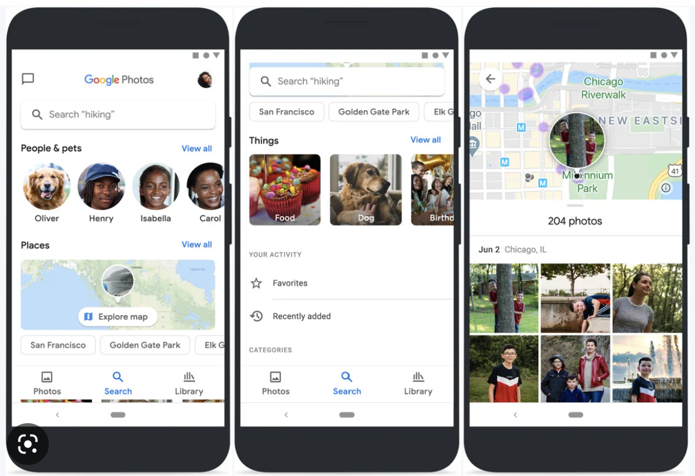

# DH110-Spring 2023 - Assignment 1 - Michelle Gunawan
## Project Overview
 For my research project, I aim to delve into the relationship dynamics within families, with a particular focus on the different ways that families can bond and connect with one another. I'm intrigued by how families keep in touch and maintain meaningful relationships through various circumstances, such as distance or other challenges they may face.

To better understand the ways that families can stay connected, I have chosen to analyze two apps: Google Photos and WhatsApp. Google Photos is an app that enables families to share memories and events through photos, fostering a sense of engagement and shared experience while WhatsApp is a widely-used communication app that facilitates seamless communication between family members, regardless of their physical location. By examining how families use these apps to maintain their relationships, I hope to gain insights into the different strategies and tools that families employ to stay connected and engaged.
 
 ## [Google Photos](https://www.google.com/photos/about/)
 
  * Google Photos is a photo and video storage app that allows users to back up and access their media files from any device with internet access. The app automatically organizes photos by date and location, and uses advanced AI technology to identify people and objects, and even pets, in the photos, making it easy to search and share specific images with family and friends. Most importantly, however, Google Photos allows users to share their photos with others, either by creating shared albums or sending individual photos or links.
  
  * Overall Evaluation: With the ability easily share media through shared albums or by sending individual photos or links, Google photos allow families to share their memories with each other in a seamless and engaging way. Additionally, The app's cloud-based storage ensures that photos are accessible from any device with an internet connection, making it easy for families to stay connected and share their experiences. Overall, Google Photos is a great app for families.
  
  | Heuristic | Evaluation | Improvement |
  | :-------: | :--------: | :---------: |
| #1: Visibility of system status:   Let the user know what is going on | Bad: When uploading photos, Google Photos shows a bar around the user's profile indicating the progress of the upload. However when the user goes to the page of photos being uploaded. Google does not indicate which photos are currently being uploaded or the progress of the upload of photo currently being uploaded. | Google Photos can do better at indicating   what it is currently updating and   it's current progress on each individual photo |
|#2: Match between system and the real world:   The design should speak the users' language | Good: Google Photo's design is pretty intuitive due to its standardization of language. They call their photos 'photos' and a collection of photos 'albums' | Because their language is intuitive, there is not much need for imrovement in this area |
|#3: User control and freedom:   Users need a clearly marked "emergency exit" to leave the unwanted action without having to go through an extended process| Good: Google Photos presents user with an 'undo action' pop up whenever they delete a photo or add a photo to an album. | One thing they could improve could be the time of the popup. These popups only show up on screen for around 5 seconds which can be a little too short for some users. They can either test to find an ideal time or have a popup that stays up until the user removes it from view. |
|#4: Consistency and standards:   Users should not have to wonder whether different words, situations, or actions mean the same thing| Good: Google Photos has pretty much uses terminology that is often associated with photos. It has also standardized the terminology throughout the app. For example, the term 'share' means to share media with other people whether that be through albums, links, or just through sending individual media | Since there isn't a problem here, there is no need for improvement in this category. |
|#5: Error prevention: Carefully prevent problems from occurring in the first place| Good: Google Photos checks confirms with users before they finalize a delete photo. It also has a recycle bin and reminds users that they can recover deleted photos from the recycle bin within 30 days of deletion. | There is not much improvement needed in this area |
|#6: Recognition rather than recall: Minimize the user's memory load by making elements, actions, and options visible| Bad: The 'backed up' symbol that lets users know that a particular photo has been uploaded to the cloud and can be deleted from local device is not very clearly displayed on image, leaving users to have to comb through their images to make sure they don't accidently delete a photo that has not been backed up | Google Photos could make the symbol more visible on photos to prevent users from accidently deleting local photos and having to take many more steps to remedy their error |
|#7: Flexibility and efficiency of use: Shortcuts so that the design can cater to both inexperienced and experienced users| Bad: There are no shortcuts on the app | To provide more customization options for power users, Google Photos could introduce advanced settings or preferences that allow users to customize how their photos are organized and displayed, setting up automated actions or workflows, or simply just create shortcuts for users to move from one tab to another |
|#8: Aesthetic and minimalist design: Interfaces should not contain information that is irrelevant or rarely needed| Bad: Though the Google Photos interface is very clean and aesthetic, it is a little crowded. The app has so many services, such as photo book ordering, that it can sometimes feel like they are jamming various services anywhere they have screen space | Organize each tab so that it is more intuitive for users of the app to find stuff |
|#9: Help users recognize, diagnose, and recover from errors: Error messages should be expressed in plain language and suggest a solution|Good: Google Photos error messages are clear and easily readable | Sometimes the error messages can be a bit wordy. A small improvement could be to make them a little bit more concise|
|#10: Help and documentation: documentation to help users understand how to complete their tasks|Good: Google has a [Google Photos FAQ](https://support.google.com/photos/?hl=en)| Google has done a good job creating faq pages and creating forums for Google Photos problems that often come up|

Severity Rating:
* Top Priority: Visibility of system status; Recognition rather than recall; Aesthetic and minimalist design
* Small Inconvenienc: User control and freedom; Flexibility and efficiency of use; Help users recognize, diagnose, and recover from errors
* Not an issue: Match between system and the real world; Consistency and standards; Error prevention; Help and documentation
 
 ## [Whatsapp](https://www.whatsapp.com/)
 
  * WhatsApp is a messaging app that enables users to send and receive text messages, voice messages, photos, and videos, as well as make voice and video calls. The app uses end-to-end encryption to ensure that messages and calls are secure and private. WhatsApp also offers group chat functionality, allowing users to create groups of up to 256 members, making it ideal for families to stay connected and communicate with multiple family members at once. Additionally, WhatsApp supports a range of multimedia features, such as stickers and GIFs, to make messaging more engaging and interactive.
  
  * Overall Evaluation: WhatsApp is a highly versatile and reliable app that is an excellent choice for families looking to stay connected and communicate with one another. Its ease of use, end-to-end encryption, and group chat functionality make it an ideal choice for families who want a secure and convenient way to stay in touch.

  | Heuristic | Evaluation | Improvement |
  | :-------: | :--------: | :---------: |
| #1: Visibility of system status:   Let the user know what is going on | Good: Whatsapp is able to convey to users what is going on in real time. For example, if someone is typing, it will display 'UserX typing...' in the header. Additionally, in groupchats, Whatsapp will inform senders if/when their message has been seen by group members | There is no improvement needed in this category |
|#2: Match between system and the real world:   The design should speak the users' language | Good: Users are able to adjust their settings to change language in order to better suit their needs. Whatsapp follows the language of the phone, making it easy for users to adjust to the app without having to take extra steps to look for the language settings. | There is no improvement needed in this category |
|#3: User control and freedom:   Users need a clearly marked "emergency exit" to leave the unwanted action without having to go through an extended process| Good: User is able to delete their message up tto one hour after sending it. This one hour window allows flexibility for the sender while also protecting the receiver. Bad: When a user deletes a chat, it is deleted forever without the chance of recovery | Whatsapp could have a recycle bin to temporarily hold deleted entities |
|#4: Consistency and standards:   Users should not have to wonder whether different words, situations, or actions mean the same thing|Good: The Whatsapp UI complies to basic chat user interfaces, thus making it easy for users to navigate. Bad: In the settings, it can be hard to find certain things | Implement a search bar in the settings page to allow users to find certain settings easier |
|#5: Error prevention: Carefully prevent problems from occurring in the first place| Good: Whatsapp confirms with users before they delete a message, asking them if they want to delete just for themselves or delete for everyone. Bad: When a user chooses to 'delete for me', there is no way the user is able to access that message again, as in they will be unable to see that message and they will be unable to delete that message for everyone. | Whatsapp could implement some sort of safeguard against the 'delete for me' option  |
|#6: Recognition rather than recall: Minimize the user's memory load by making elements, actions, and options visible| Good: The Whatsapp UI is easily recognizable, including 4 main tabs: Chat, Status, Calls, and Settings. Bad: However, as mentioned previously, the settings page can be difficult to navigate. There are terms such as 'linked devices' that may be unfamiliar to users.| Perhaps, implementing some sort of search/filter function in the settings page could improve the user experience in the search tab |
|#7: Flexibility and efficiency of use: Shortcuts so that the design can cater to both inexperienced and experienced users| Good: Whatsapp has small featues such as swiping to see if a message you sent in a groupchat has been received and read by other groupchat members | Though this is not an advanced users, it is a somewhat hidden feature that not all users know about. If Whatsapp would like more users to know about it they could have a temporary popup to show users this hidden feature|
|#8: Aesthetic and minimalist design: Interfaces should not contain information that is irrelevant or rarely needed| Good: The Whatsapp UI is clean an easil navigatable. Bad: Whatsapp has a 'Status' tab that does not seem to be very popular. | Whatsapp could take more advantage of its status page to make it a more useful feature for the app or remove it all together |
|#9: Help users recognize, diagnose, and recover from errors: Error messages should be expressed in plain language and suggest a solution| Good: Whatsapp asks users about the quality of their video and voice calls in order to prevent future errors | No improvement needed as Whatsapp already presents feedback in a friendly, easily digestible manner. |
|#10: Help and documentation: documentation to help users understand how to complete their tasks|Good: Whatsapp has a [Whatsapp Help Center](https://faq.whatsapp.com/)| Whatsapp has done a good job creating faq pages and creating forums for Whatsapp problems that often come up|

Severity Rating:
* Top Priority: User control and freedom; Error Prevention; 
* Small Inconvenience: Consistency and standards; Recognition rather than recall, Flexibility and efficiency of use
* Not an Issue: Visibility of system status; Match between system and the real world, Aesthetic and Minimalist Design; Help users recognize, diagnose, and recover from errors; Help and documentation
